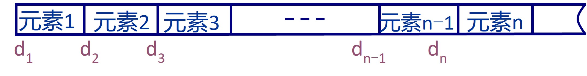
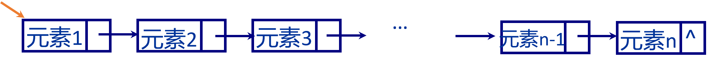
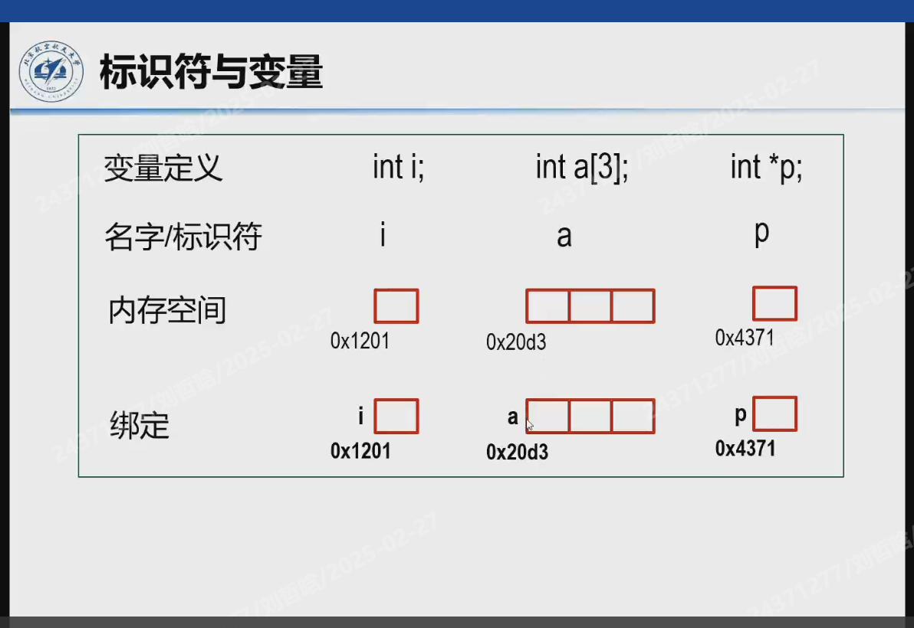

# 数据结构与算法
## Lecture 1 
### 数据结构
1. 什么是数据结构
    + <u>数据元素 + 关系</u>： **Data-Sturcture = (D,R)**
2. 逻辑关系
   1. 线性结构：线性表、栈、队列、串、文件
   2. 非线性结构：二叉树、树、图、集合
3. 存储结构
   1. 顺序 sequential: 地址连续的存储单元 
   + 
   2. 链式 linked: 地址任意的存储单元，每个数据节点：数据+指针
   + 
   3. 索引 indexing:
   4. 散列表 hashing: 散列函数的关系与冲突处理
4. 操作
    + 构造：构造具有某种逻辑结构的数据集，如构造一个线性表、链表、树和图等
    + 检索：在已有数据集中查找某一指定元素
    + 插入：在已有数据集中插入一指定元素
    + 删除：在已有数据集中插入一指定元素
    + 排序：对一数据集中元素按照某一顺序进行排列
    + 遍历：访问数据集中所有元素
---
### 算法
1. 输入、输出、有穷、确定、有效！
2. 算法分析：
   1. 时间复杂度 -- 最关注最高次数！通常指最坏时间复杂度
    ```Python
        i = 1
        j = 0
        while (i + j <= n):
            if(i > j):
                j++
            else:
                i++;
    ```
    + 此代码的if语句执行n次, 算法时间复杂度 O(n)
    ```C
        int time(int n)
        {
            int cnt = 0, x = 2;
            while(x < n/2)
            {
                cnt++;
                x *= 2;
            }
            return cnt;
        }
    ```
    + 此代码的算法时间复杂度 O(log n)(省略底数2)
   2. 空间复杂度
3. 关于变量-进阶学习
   + 