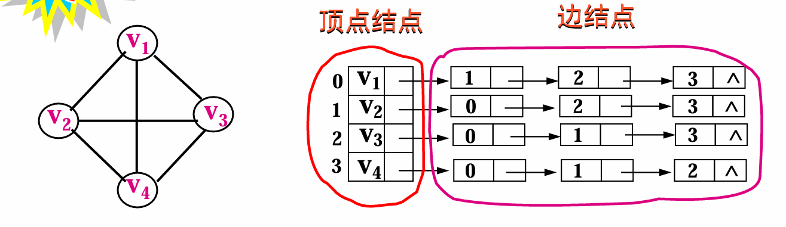

# 第10讲 图-简单图

## 概念
1. **顶点 + 边**
   
2. **分类**：有向图，无向图，网络（边上带有权值）
3. **度**：依附于顶点$v_{i}$的边的数目 $TDv_{i}$
      + 对于有向图，还分为**出度**和**入度**
      + 几个常用结论：$$边数 = \frac{1}{2} \sum_{i=1}^n TDv_{i}$$ $$无向图最多有 \frac{n(n-1)}{2} 条边$$ $$有向图最多有 n(n-1) 条边$$
      + **用组合数计算即可**
    + 完全图：边的数目最大
8*7/2*1
4. **路径、路径长度**：严格定义略 
   1. 回路、环：出发点与终止点相同的路径
   2. 路径长度：路径上所经过的边的数目，径上经过的边上的权值之和（带权图）

5. **图的连通**
   1. 结点连通和图的连通
   2. 其中，有向图的连通：必须是**双向“连通”**
   3. 常用结论：对于一个n个顶点的图 $$边数 < n-1，图将不连通$$ $$边数> n-1 图回有环$$   $$连通且仅有n-1条边 \leftrightarrow 无回路且连通$$
 
6. **生成树**（陌生）
   1. 对于一个n个结点连通图，砍去边，只剩下**n-1条边的连通子图**（极小连通子图）
   2. 生成树不唯一
   3. 见map2.md
---
## 图的储存方式

### 邻接矩阵
1. 数组1 `VERTEX[0..n-1]` 存放图中所有顶点
2. **邻接矩阵**：定义一个二维数组 `A[0..n-1, 0..n-1]` 存放图中顶点关系信息（称为**邻接矩阵**）：
$$
A[i][j]=\begin{cases} 
1 & \text{当顶点 }v_i\text{ 到顶点 }v_j\text{ 有边时} \\ 
0 & \text{当顶点 }v_i\text{ 到顶点 }v_j\text{ 无边时}
\end{cases}
$$

+ 对于带权图，邻接矩阵定义为：
$$
A[i][j]=\begin{cases} 
w_{ij} & \text{当顶点 }v_i\text{ 到 }v_j\text{ 有边，且边权为 }w_{ij} \\ 
\infty & \text{当顶点 }v_i\text{ 到顶点 }v_j\text{ 无边时}
\end{cases}
$$

3. **特点**
   + 无向图的邻接矩阵一定**对称** 
   + 有向图：对于某个节点i：$$第i行非0或非∞元素的个数为第i个顶点的出度$$     $$第i列非0或非∞元素的个数为第i个顶点的入度$$

```C
Vertype Vertex[MaxV];
struct edge{ 
    int v1, v2;
    int weight;
} E[MaxE];
```

### 邻接表 

**适用于在两个结点存在多条路径的情况**

1. 顶点结点作为单独一个链表的头
   +  链结点：表示以第i个顶点为的一条边
   +  
2. 特点：
   + 无向图： 第i个链表中边结点个数是第i个顶点度数
   + 有向图： 第i个链表中边结点个数是第i个顶点的出度
```C
 typedef struct edge{ 
    int adjvex;
    int weight;
    struct edge  next;
 }ELink;

 typedef struct ver{
    vertype vertex;
    ELink *link; // 注意
 }VLink;

VLink G[MaxV];
```

## 图的基本操作

### 创建、读取、插入
```C
// 在链表尾插入新节点
Elink* insertEdge(Elink *head, int avex) {
    Elink *e, *p;
    e = (Elink*)malloc(sizeof(Elink));
    e->adj = avex;
    e->wei = 1;          // 默认权重为1
    e->next = NULL;
    //判断空表
    if (head == NULL) {
        head = e;
        return head;
    }
    //往后遍历
    for (p = head; p->next != NULL; p = p->next);
    p->next = e;
    return head;
}

// 创建无向图的邻接表
void createGraph(Vlink graph[]) {
    int i, n, v1, v2;
    scanf("%d", &n);     // 读入顶点个数
    
    // 初始化邻接表
    for (i = 0; i < n; i++) {
        graph[i].link = NULL;
    }
    
    // 构建邻接表
    for (i = 0; i < n; i++) {
        scanf("%d %d", &v1, &v2);  // 读顶点和第一条边
        while (v2 != -1) {
            graph[v1].link = insertEdge(graph[v1].link, v2);
            graph[v2].link = insertEdge(graph[v2].link, v1);  // 无向图双向插入
            // 邻接矩阵赋值
            int adjMatrix[MaxV][MaxV];
            adjMatrix[v1][v2] = adjMatrix[v2][v1] = 1;  // 无向图对称赋值  
            scanf("%d", &v2);      // 读下一条边
        }
    }
}
```
---


### 图的遍历：广度优先搜索（BFS）与深度优先搜索（DFS）

#### 广度优先搜索（BFS）
##### 核心思想
从起点开始分层访问：先访问所有邻接点（1跳），再访问邻接点的邻接点（2跳），依此类推。  
使用队列保存待访问节点，保证“先访问的节点其邻接点先被访问”。  
每个顶点仅访问一次（需`visited`数组标记）。

##### 算法流程
1. 起点入队并标记访问。  
2. 当队列非空时：  
   a. 队首节点出队。  
   b. 访问该节点的所有未访问邻接点，入队并标记。  
3. 重复直到队列为空。  

```c
void BFS(VLink G[], int start) {
    Queue Q = createQueue();      // 创建队列
    enQueue(Q, start);            // 起点入队
    Visited[start] = 1;            // 标记访问
    
    while (!isEmpty(Q)) {
        int cur = deQueue(Q);      // 队首出队
        VISIT(cur);                // 访问当前节点（如打印）
        
        ELink *p = G[cur].link;    // 获取邻接表头节点
        while (p != NULL) {        // 遍历所有邻接点
            int neighbor = p->adjvex;
            if (!Visited[neighbor]) {
                Visited[neighbor] = 1;  // 标记访问
                enQueue(Q, neighbor);   // 邻接点入队
            }
            p = p->next;
        }
    }
}
```

#### 特点
- **路径性质**：找到的路径是最短路径（边数最少）。  
- **时间复杂度**：邻接表 O(V+E)，邻接矩阵 O(V²)。  
- **空间复杂度**：O(V)（队列最大长度）。  


#### 深度优先搜索（DFS）
##### 核心思想
递归深入：沿单条路径访问到底，再回溯探索新路径。  
使用栈（递归隐式使用调用栈）保存访问路径。  
每个顶点仅访问一次（需`visited`数组标记）。

##### 算法流程
1. 访问当前节点并标记。  
2. 递归访问其第一个未访问邻接点。  
3. 回溯后继续访问下一个未访问邻接点。  
递归算法略
```c
int path[1001];
void DFS(VLink G[], int cur，int level) {
    VISIT(cur);                // 访问当前节点
    Visited[cur] = 1;          // 标记访问
    
    ELink *p = G[cur].link;    // 获取邻接表头节点
    while (p != NULL) {        // 遍历所有邻接点
        int neighbor = p->adjvex;
        if (!Visited[neighbor]) {
            DFS(G, neighbor);  // 递归访问未访问邻接点
        }
        p = p->next;          // 继续下一个邻接点
    }
    //输出路径等等操作
}
```

##### 特点
- **路径性质**：适合寻找所有可行路径。  
- **时间复杂度**：邻接表 O(V+E)，邻接矩阵 O(V²)。  
- **空间复杂度**：O(V)（递归栈深度）。  


## BFS vs DFS 核心对比
| **特性**         | **BFS**                | **DFS**                |
|------------------|------------------------|------------------------|
| **数据结构**     | 队列                   | 栈（递归/显式）        |
| **路径性质**     | 最短路径               | 任意路径               |
| **空间消耗**     | 邻接点多时较高         | 路径深时较高           |
| **适用场景**     | 最短路径、网络爬虫     | 拓扑排序、连通分量、回溯问题 |
| **解的出现顺序** | 由近及远               | 一条路走到底再回溯     |

### 扩展说明
实际应用中，BFS/DFS 常需扩展（如记录路径、多次访问节点等）。例如：  
- 独立路径搜索问题需在 DFS 中撤销访问标记（`Visited[cur] = 0`），允许节点重复出现在不同路径中。