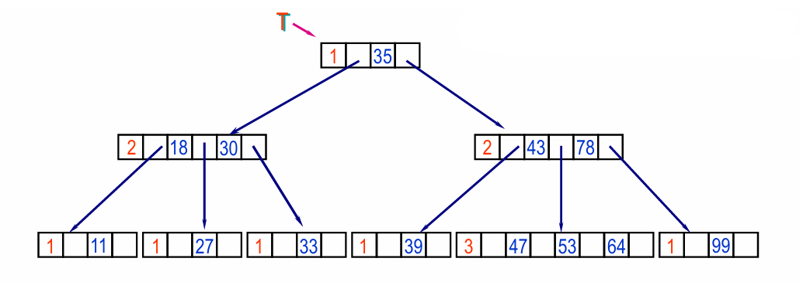
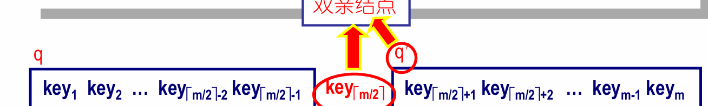
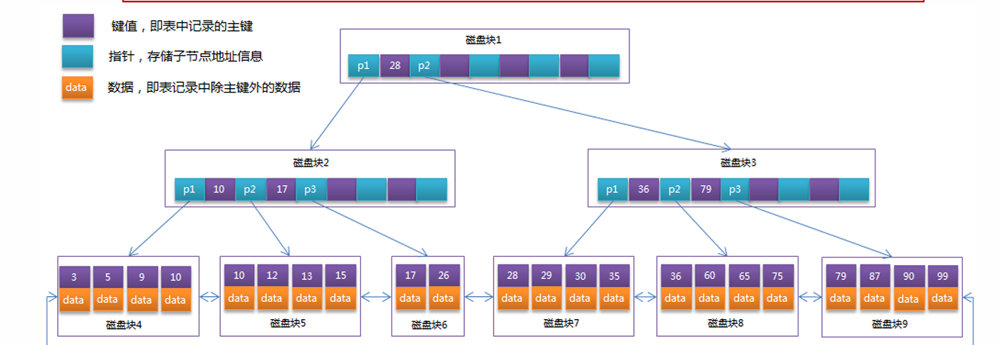
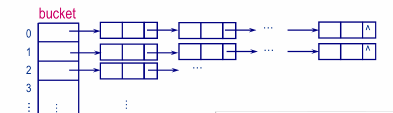

# 第12讲 查找
**Key -> Element**
---
## 查找表
1.  **定义**：查找表是存储一组键值对（Key-Element）的数据结构，支持高效的查找操作。

## （选择） **ASL 平均搜索长度** 
  **概念**： 等概率情况下，搜索成功的比较次数的平均值。
   1. 顺序查找 
$$
ASL_{\text{顺序查找}} = \frac{1}{n} \sum_{i=1}^{n} i = \frac{1 + 2 + \cdots + n}{n} = \frac{n+1}{2}
$$
   2. 折半查找
$$
ASL_{\text{折半查找}} \approx \log_2 n
$$

> 精确值计算，建立一个平衡二叉树，查找总次数= 每一层的元素数 × 深度，平均。 
$$
ASL_{\text{success}} = \frac{\sum_{i=1}^{n} \text{depth}(a_i)}{n}
$$
**例如：**     
```  
        [5]              ← 第1次比较（深度1）
       /     \
     [3]     [7]          ← 第2次比较（深度2）
    /   \    /   \
  [2] [4]  [6]  [8]       ← 第3次比较（深度3）
 /                \
[1]                [9]     ← 第4次比较（深度4）
```


## 索引
1. **定义**：记录关键字值与记录的存储位置之间的对应关系
2. **分类**
   1. **稠密索引**：
      - 每个关键字都有对应的索引项。
    2. **分块索引**
       1. 块间有序，块内可以无序。
       2. 每个块有一个索引项，指向该块的第一个记录。
       3.  适用于大数据量，减少索引项数量。
   3. **多级索引**：
      1. 树状结构的多级索引
## 折半查找

## 重点 B-树 多路平衡查找树

**本质上，B-树结合了以下优势：**
1.  线性表的“有序”和“二分查找”优势

2.  链表/树的“非连续存储”特性

3.  克服了二叉查找树（BST）的“树高太深”问题
  
 ### B-树定义 
 对于一个 **m阶B-树：m叉树**
   1. **根节点**：至少有两个子节点（除非是叶子节点，即一个控根）
   
   2. **除叶子、根节点以外的结点**：
   $$ m < 子节点（子树）< ⌈m/2⌉ ; 关键字个数 = 子树数目 - 1 $$
   3. **叶子结点**: 在同一层至多有m-1个关键字。
   
   4. **每个节点**：至多有m-1个关键字: keys[m+1],  ptr[m+1]
   > $n, p_0, key_1, p_1, key_2, p_2, ...,  key_n, p_n$
   - n: 关键字个数，小于m-1
   - p0, p1, ..., pn: 子节点指针
   - key1, key2, ..., keyn: 关键字, **有序(递增)**


例子：**四阶B-树**


  
### B-树的查找
1. **查找过程**：
      
      1. 查找节点内**集合中的关键字**，找到**第一个大于等于关键字$i$的关键字**。(顺序查找或折半查找)
   
      2.  如果关键字$i$等于结果，返回该节点$p_i$。
   
      3.  如果关键字$i$大于结果，进入对应的子节点$p_{i-1}$

      4.  如果 $p_i-1$ =  NULL，说明查找失败。
2.  循环上述步骤，直到找到关键字或到达叶子节点。
3.  与二叉查找树**核心思想相同**，但B-树的每个节点可以有多个关键字和子节点，
   - **比较结点数据**变成了**比较关键字的集合**，**找到合适的子节点**。
   - **节点内变胖变多了！**
4. 缺点：删除节点复杂，关键字获取复杂
```C
#define M 1000
#define Maxkey 1000000
typedef struct BTreeNode {
    int n;              // 关键字个数
    keytype keys[M+1] //记录Maxkey,一个很大的数，
    struct BTreeNode *p[M+1]; // 子节点指针数组
     rectype *recptr[M+1]; //指向数据记录
} BTreeNode;

//找到第一个小于等于k的关键字
keytype bsearchBTree(keytype *keys, int left, int right, keytype k) {
    int mid;
    while(left <= right) {
        mid = (left + right) / 2;
         // 将小于等于两种情况合并，等于也不返回，这样就可以找到第一个小于等于k的关键字。
        if(keys [mid] <= k) { 

            left = mid + 1;
        } else {
            right = mid - 1;
    }
    return left; 

}

keytype searchBTree(BTreeNode *root, keytype key) {
    BTreeNode *p = root;
    int i, n; // i记录查找位置， n记录该节点总的关键字数
    while(p != NULL)
    {
        n = p->n;
        p->key[n+1] = Maxkey; //细节：设置最大值，查找时不用每次检查“是不是越界”或“是不是最后一个“

        //顺序查找 第一个大于等于K 的值
        i = 1;
        while(k > p->key[i]) i++;
        //折半查找
        // i = bSearch(p->key, 1, n, k);

        if(k == k->key[i]) return p->key[i];

        else p = p->ptr[i-1];
    }
    return -1;
}
```

### B-树的插入（会思想，不要求代码）
1. **查找插入位置**：与查找相同，找到合适的叶子节点。
2.  **插入关键字**：
   - 如果叶子节点未满（n < m-1），直接插入。
   - 如果叶子节点已满（n = m-1），需要分裂节点。
     -  分裂节点：
       1. 将中间关键字上升到父节点。
       2. 分裂成两个节点，左边的节点保留前半部分1到⌈m/2⌉-1，右边的节点保留后半部分⌈m/2⌉到m-1。
       3. 更新父节点指针： 插入：key[i] = p->key[n/2]， p->ptr[n/2+1]。
        4. 直到父节点不满
     1. 
>请画出依次插入关键字序列(5, 6, 9, 13, 8, 
1, 12, 14, 10, 4, 3)中各关键字值以后的**4阶**B-树。

## B+树
1. **定义**：B+树是B-树的变种，**所有关键字都存储在叶子节点**，非叶子节点只存储索引。
2. 特点：
   1. 分支结点是索引的索引
   2.  叶子节点存储所有数据，之间通过指针相连，形成链表。
   3.  
3.  实现范围查询更高效


## 散列表，散列查找(Hash Table)
1. **定义**：散列表是通过哈希函数将**关键字**映射到**数组索引**的查找表。
2.  **哈希函数**：将关键字转换为数组索引的函数。
   - 例如：A = h(key) = key % table_size
   -  **冲突**：不同的关键字映射到同一个索引。H(ki) = H(kj)

### 构造散列函数 哈希函数
1. 值域：若散列表允许有m个位置时，则函数的值域为[0 .. m–1]。
2. 均匀
3. 简单易计算
4.  散列函数的设计
   - 直接定址法：h(key) = a * key + b
   - 数字分析法：将关键字分成几部分，取其中一部分作为索引。
   - 平方取中法：将关键字平方后取中间几位作为索引。
   - 折叠法：将关键字分成几段，求和后取模。
   - **除留余数法**：h(key) = key % p (p < m  且 p 是素数)
   - 一般而言，**P取小于表长的最大质数**，冲突较少。
  
5. 负载因子：
   - 负载因子α = n / m
   - n：散列表中元素的个数
   - m：散列表的大小
   - 负载因子越大，冲突概率越高。

### 散列冲突处理
1. **开放地址法**：当发生冲突时，寻找下一个空位。
   - **线性探测**：h(key) = (h(key) + i) % m 一个个往后移
     - ”容易产生元素“聚集”的问题。
   - **二次探测**：di=1^2, -1^2,  2^2, -2^2, …, 
     - h(key) = (h(key) + d_i) % m 
     - i ：探测次数 1, 2, 3, ... 直到位置为空    
     - 不能探测到表中的所有元素
   - 删除时，不能直接删除元素，而是标记为“已删除”，以便后续查找时跳过。
   - 时间效率随负载因子升高显著下降。

   
2. **链地址法**：每个索引位置存储一个链表，冲突的元素链接在一起。
    - 适用于负载因子较高的情况。
    - 查找时，先计算哈希值，然后遍历链表查找。
    - 删除操作
    - 时间效率更高

3. **再哈希法**：当发生冲突时，使用另一个哈希函数重新计算索引。
4. 典型应用：

三个问题
| 问题                | 正确答案            | 原因简述               |
| ----------------- | --------------- | ------------------ |
| 哪种查找法 ASL 与 n 无关？ | **散列查找**        | 直接定位，查找时间不随元素数线性增长 |
| 链地址法为何比开放地址法效率高？  | **更适应冲突、多元素情况** | 聚集小、冲突局部化、查找速度稳定   |
| 哪种查找法只能在顺序存储结构上？  | **折半查找**        | 需支持随机访问中间元素（即数组）   |
