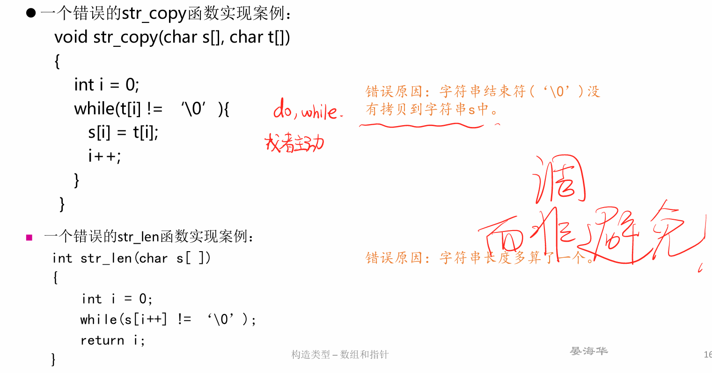
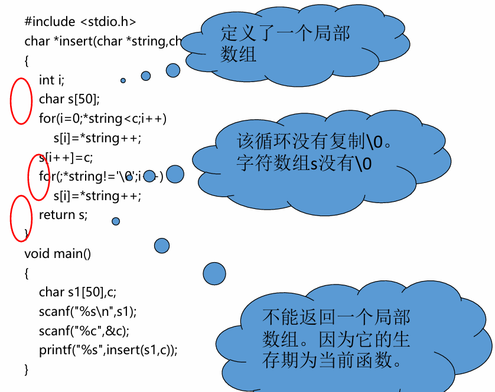
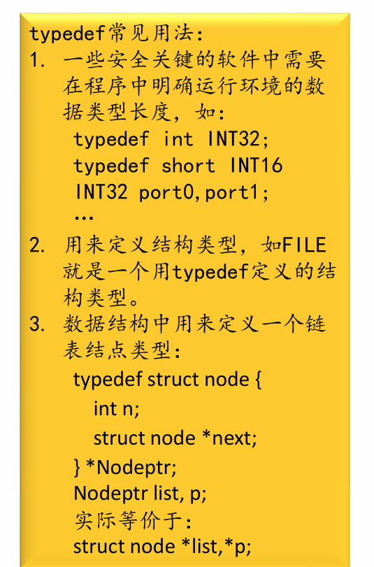
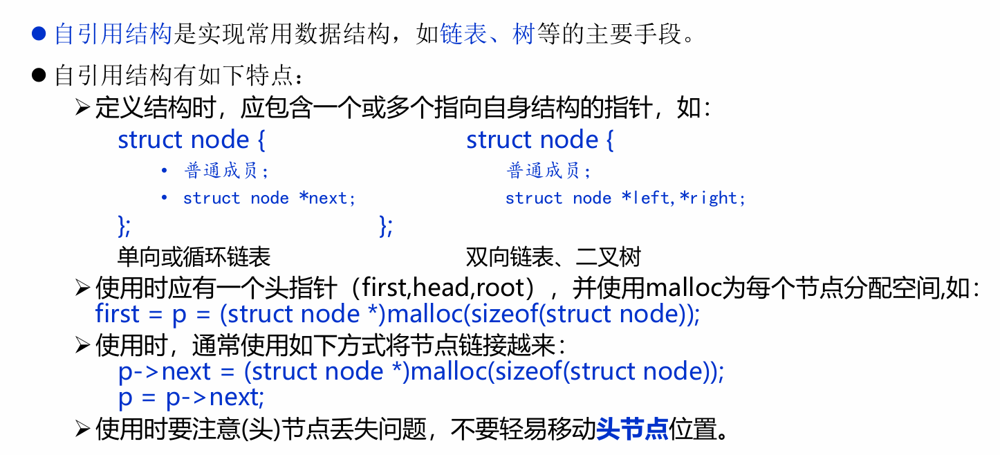

## lecture3 pointer & sturcture

### pointer
1. 运算
   1. +：自增、与整数相加表示后移多少单位（数组）
   2. -: 指针相减表示差多少“单位”，与整数相减
        + 如 指针的折半查找：`mid = low + (high – low) / 2;` 不能是`mid = (high + low)/2`无意义
   3. 赋值 -- shallow copy （只复制指针，而不拷贝内容）
        ```C
        int main()
        { 
            char *p;
            …
            p = fun(); // 此时出现指针悬挂，无所指。
            …
        }
        char *fun()
        { 
            char *p, str[20]=“Hello World”;
            …
            p = str;
            return p;
        }
        ```
         + deep copy -- `strcpy(px, py)`复制内容
2. 关于数组名 - 常量指针
    + `int a[10]; a++` 是违法的
    + 直接给数组名赋值 如：
         ```C
        char word[20];
        word = "You can't do this to me.";
        ```
        是违法的
3. 函数指针
    1. 函数名就是指向函数的指针
    2. 功能：函数派遣表：
        ```C
        int fn0(),fn1(),...,fn9();
        int (*dispatch[])() = {fn0,fn1,...,fn9};//定义函数指针数组，里面存放9个函数指针
        (*dispatch[index])();
        ```
    ```C
        in = fopen(argv[1], "r");
        while(fscanf(in, “%s”, s[i]) != -1)
            i++;
    ```
4. 易犯错误
   
   
5. 指针后处理循环
   1. 先将第一个作为指针初始
   2. 或者可以使用 malloc 函数
        ```C
        first = ptr = (struct Node *)malloc(sizeof (struct Node));
        first->line = NULL;
        ```

### structure
1. 结构变量声明
    1. 使用`typedef`关键字
        ```C
        typydef sturct date
        {
            ...
        }DATE;
        DATE d,*pd,ad[10];
        ```
    
    
    2. 结构嵌套命名
       + 但不能是它本身，可以是指针，如
        ```C
        struct node{
            int a;
            struct node *next;
        }*base;
        ```
2. 变量初始化--列表，结构体数组的初始化-- 一一列表
   ```C
   struct Key {
        char *keyword;
        int count;
    };
    struct Key Keytab[ ] = {“auto”, 0,“break”, 0, “case”, 0, … ,“while”, 0};
   ```
3. 运算符`->` 指向结构的指针所指对象成员
4. 自引用结构
   + 
   + 初始化如下：
    ```C
    first = ptr = (struct Node*) malloc (sizeof(struct Node));
    first -> line = NULL;
    for(int i = 1; i < n; i++)
    {
        ptr -> next = (struct Node*) malloc (sizeof(struct Node));
        ptr = ptr -> next;
        ptr -> line = NULL;
    }
   ```
### homework 
1. 指针数组的定义 优先级 [](->) > * 
   1. `int (*p)[5]`== `int p[5]`  与 `int *p[5]`的区别
2.小括号 [] (->) > ++(自增自减) > * 
    1. ++ 
      1. 前置 ++ 的特性是先对变量进行自增操作，再使用变量的值。
      2. 后置 ++ 的特性是先使用变量的值，再对变量进行自增操作。
    2. (C)  ++pt->x (pt->x)优先
      (D) (pt++)->x
    3. ++*p *++p *p++ *(p++)
       1. 后置 ++ 优先级高于 *，前置 ++ 与 * 优先级相同（结合方向自右向左）。例如，*p++ 等价于 *(p++)，而 ++*p 等价于 ++(*p)。
       2. *p++ 和 ++*p 都是对值做加法！
1. fscanf(文件指针, 格式字符串, 输入表列);
2. 指针悬挂问题 
    + 函数内部的常数组，函数结束后就空了