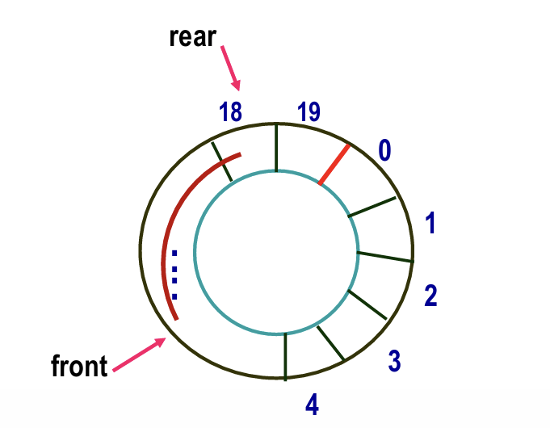

# lecture 7 队列
---

## 概念
**FIFO 先进先出** 一端插入，一端删除
>> 出队 front <- b | c | d | e | f <- rear 进队
**front出队，rear入队！！**
---

## 基本操作与实现

### 基本操作
1. 插入
2. 删除
3. 测试是否为空
4. 检索队头
5. 创建空队
均为 $O(1)$
### 1.顺序存储结构
+ **构造原理** 一维数组 `Queue[0,..., M-1]`
+ **缺陷** 队元素需要频繁的进出，如，rear很容易到达数组尾巴，但实际没有超出数组大小。
  + 初始化 `front = 0` `rear = -1`
+ **循环队列** 头尾相连 
  + 
  + 即`rear > MAXSIZE` 或者`front < 0`时，我们就让它“转回去”。
  + 在循环队列中，出队操作时，$front=(front + 1)\%队列长度$；入队操作时，$(rear=(rear + 1)\%队列长度$，
  + 例题：
  + >>己知循环队列存储在一维数组A[0-n-1]中，且队列非空时front和rear分别指向队头元素和队尾元索。若初始时队列为空，且要求第1个进入队列的元素存储在A[0]处，则初始时front和rear的值分别是 (front = 0, rear = n-1)

```C
#define MAXSIZE 1000
QElemType QUEUE[MAXSIZE];
int front, rear, count;

// 初始化队列
void  initQueue() {
 front = 0;
 rear = MAXSIZE-1;
 count = 0;
 }
//测试空满
int isEmpty() return count == 0;
int isFull() return count == MAXSIZE;
void enQueue(ElemType queue[], ElemType item){
    if(isFull())            /* 队满，插入失败 */
        Error("Full queue!");
    else{                   /* 队未满，插入数据 */
        rear = (rear+1) % MAXSIZE;
        queue[rear]=item;
        count++;
    }
}
ElemType deQueue(ElemType queue[]){
    ElemType e;
    if(isEmpty())
        Error("Empty queue!");  /* 队空，删除失败 */
    else{
        e=queue[Front];
        front = (front+1)%MAXSIZE;
        count--;               /* 队非空，删除成功 */
        return e;
    }
}
```

### 2. 链式储存结构

**构造原理** 用一个线性链表表示队列，`front`、`rear`分别指向头元素和尾元素的结点。
+ 对比线性表，不存在空间冗余但放不下的情况
```C
struct node { 
    ElmeType data;
    struct node   *link;
}
typedef struct node QNode; 
typedef struct node *QNodeptr;
// 初始化
QNodeptr front, rear; //定义为全局变量
void init()
{
    front = NULL;
    rear = NULL;
}
//检查空
int isEmpty(){
    return front==NULL;
}
//无需检查满
//入队
void enLQueue(ElemType item ){
    QNodeptr p;
    if((p=(QNodeptr)malloc(sizeof(QNode))) ==NULL)
        Error("No memory!");
    p->data=item;
    p->link=NULL;
    if(front==NULL)
        front=p;            /* 插入空队的情况 */
    else
        rear->link=p;
    rear=p;                 /* 插入非空队的情况 */
}
//出队
ElemType delQueue( ){
    QNodeptr p;
    ElemType item;
    if(isEmpty( ) )
        Error("Empty queue!"); /* 队为空，删除失败 */
    else{
        p=front;
        front=front->link;
        item=p->data;
        free(p);
        return item;        /* 队非空，删除成功 */
    }
}
//销毁队！
void destroyLQueue(){
    while(front != NULL)
    {    /* 队非空时 */
        rear=front->link;    
        free(Front);                 
        front=rear;
    }
}
```
## 应用
1.**例题**为解决计算机主机与打印机之间速度不匹配问题，通常设置一个打印数据缓冲区，主机将要输出的数据依次写入该缓冲区，而打印机则依次从该缓冲区中取出数据。该缓冲区的逻辑结构应该是**队列**

