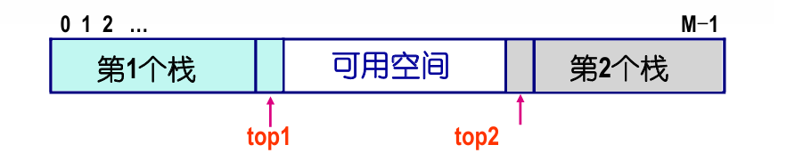

# lecture 7 栈 stack

## 基本概念 
**LIFO 后进先出** 只允许在表的一端进行插入操作和删除操作的<u>线性表</u>。
**与数组的区别**： 栈是一种<u>动态结构</u>！

|0|1|2|3|4|
|------------|------------|------------|------------|------------|
| a  | b  | c  |d|e|
|   |   |   ||↑top = 4|
---
+ **栈顶**
+ **空栈**
+ **溢出**：
    1. 上溢：栈已满时入栈。top = M-1
    2. 下溢：栈为空是出栈。top = -1
## 基本操作
1.  插入（进栈、入栈、压栈）
2.  删除（出栈、退栈、弹出）
3.  测试栈是否为空
4.  测试栈是否已满
5.  检索当前栈顶元素
### 常见题型
+ 已知输入序列，可能的输出数列：模拟法！
  + 在任何进栈操作之间，都可以夹杂任意数量的出栈操作
  + 卡特兰数：设有一顺序栈S，元素1,2,3,…,n 依次进栈，问这n个元素的合法的出栈序列个数总共有f(n)
    + 核心规律：设k最后出栈
      + 比k小的数：先于k入栈前出栈，共有$f(k-1)$种排列数
      + 比k大的数：在k入栈后入栈，先于k出栈前出栈。共有$f(n-k)$个排列
      + k最后出栈的序列个数为 $f(k-1)\times f(n-k)$
      + $f(n) = \sum_{i=1}^nf(i-1)f(n-i), f(1)=0, f(0)=0$
+ 
## 具体实现
### 1. 栈的顺序存储结构
+ **构造原理** 一维数组Stack[0,...,M-1]表示，同时设置变量Top为栈顶元素位置。
```C
    #define MAXSIZE 1000
    ElemType STACK[MAXSIZE];
    int Top; // 全局变量
    //initailize the stack
    void init_stack()
    {
        Top = -1;
    }
    int isEmpty(){
        return Top == –1;
    }
    int isFull(){
       return Top == MAXSIZE–1;
    }
    void push(ElemType item ){
        if( isFull() )
            Error("Full Stack!");
        else
            STACK[++top]=item;
    }
    ElemType pop(){
        if(isEmpty())
            Error("Empty Stack!");
        else
            return STACK[top--];
    }
```
+ 多栈共享连续空间 
  + 
  + **栈满条件** $top_{1} == top_{2}-1$
```C
    void push(int i, ElemType item ){
        if(top1==top2-1)  /* 栈满 */
            Error("Full Stack!");
        else{
            if(i==1)  /* 插入第1个栈 */
                STACK[++top1]=item;
            else  /* 插入第2个栈 */
                STACK[--top2]=item;
            return;
    }
    }
    EleType pop(int i){
        if(i==1){
            if(top1==-1)
                Error("Empty Stack1!");
            else
                return STACK[top1--];
        }
        else{
            if(top2==MAXSIZE)
                Error("Empty Stack2!");
            else
                return STACK[top2++];
        }
    }    
```

### 2.链式储存结构
+ **构造原理** 线性链表，指针变量`top`指向栈顶元素结点。栈为空时`top = NULL`
```C
    struct node {
        SElemType data;
        struct node *link;
    };
    typedef struct node *Nodeptr;
    typedef struct node Node;
    Nodeptr Top;
    void push(ElemType item ){
        Nodeptr p;//记得新建指针，而非移动top，最后赋值top
        if( (p=(Nodeptr)malloc(sizeof(Node)))==NULL ) //这里是指malloc失败，链表不需要判断满栈
            Error("No memory!");
        else{
            p->data=item;
            p->link=Top;
            Top=p;
        }
    }
    ElemType pop(){
        Nodeptr p;
        ElemType item;
        if (isEmpty())
            Error("Empty Stack!");
        else{
            p=Top;
            item=Top->data; //保存数据
            Top=Top->link;
            free(p);
            return item;
        }
    }     
```
## 栈的应用
1. **迷宫问题**  用栈记录路径：前进——进栈；回退——出栈，对应dfs里面的前进与后退
2. **括号匹配**
+   利用栈做匹配，依次读取一个字符，做如下判断：
    + 遇到左括号'(‘, '{‘, '[' 则压入栈
    + 遇到右括号')' , '}' , ']' 和栈顶元素
    栈顶元素出栈, 否则匹配失败
    + 最后检查栈匹配，匹配到相应的左括号，则内没有其他元素则匹配成功.