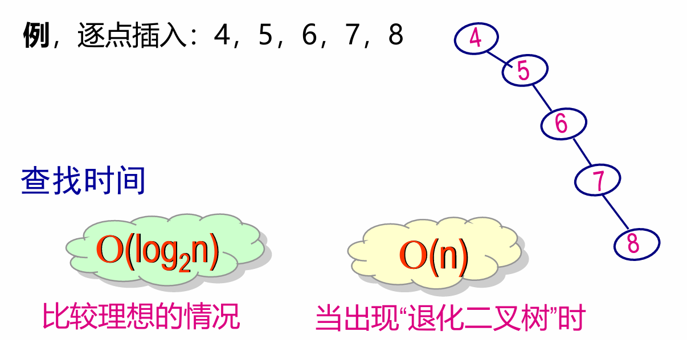
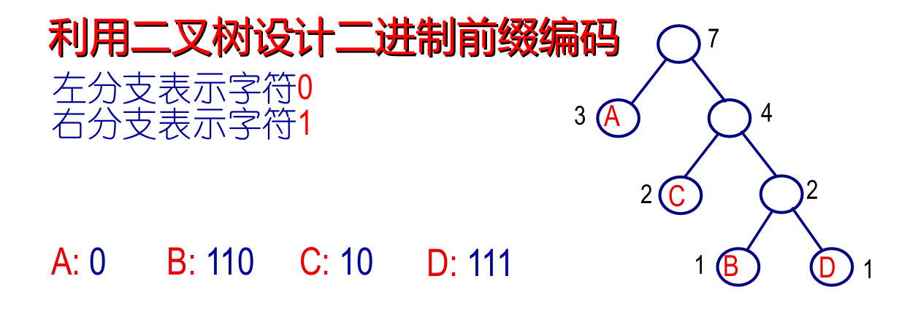

# 树的应用
## 一、二叉排序树（BST）
+ 非常适合数据量大、且无序的数据，如单词词频统计（单词索引）等。

**1. 概念** **左子树 < 结点 <= 右子树**（递归定义）

**2. 查找指定数据：结合链表与线性表二分查找的优点**

1. 流程：
   1. **判定树是否为空！（养成好习惯）**
   2. 查找：
      + 若等于根结点的值,则查找成功，结束;   
      + 若小于根结点的值,则到根结点的左子树中重复上述查找过程;
      + 若大于根结点的值,则到根结点的右子树中重复上述查找过程;
   2. 如果子树为空，则查找失败，直接返回NULL!
2. 非递归代码
```C
Nodeptr searchBST(Nodeptr root, Type key)
{
    Nodeptr p = root;
    while(p != NULL)
    {
        if(key == p->data)  return p;
        if(key < p->data) p = p->lchild;
        else p = p->rchild;
    }
    return NULL;
}
```
3. 查找效率 **平均查找长度ASL：元素间的比较次数的期望值**
   1. $$ASL = \sum_{i=1}^n p_{i} c_{i}$$
      + n 二叉树中结点的总数；pi 表示查找第i个元素的概率 ci 表示查找第i个元素需要进行的元素之间的比较次数。
    2. $$ASL = \frac{1}{n}\sum_{i=1}^m m_{i} i$$
       1. n 总结点数，m 总层数，$$m_{i}$$ 第i层的节点数

**3.建立查找树** 
**与查找方式相同**
1. 二叉树为空，作为根节点。
2. 小于根节点，进入左子树。
3. 大于根节点，进入右子树。
4. 非递归代码
```C
Nodeptr root = NULL;
Nodeptr insertBST(Type key)
{
    Nodeptr p = (Nodeptr)malloc(sizeof(Nodeptr));
    /*建立新节点，略*/
    if(root == NULL)
    {
        root = p;
        return;
    }
    Nodeptr q = root //遍历用的结点
    while(1)
    {
        if(key < q->data)
        {
            if(q->lchild == NULL)
            {
                q->lchild = p;
                break;
            }
            else q = q->lchild
        }
        else if(key > q->data)
        {
            if(q->rchild == NULL)
            {
                q->rchild = p;
                break;
            }
            else q = q->rchild;
        }
    }
    return NULL;
}
```
**4. 查找判定树：以中间元素作为树根**

## 二、平衡二叉树：AVL
+ 二叉查找树的缺陷：树的深度差无法预料，有可能变为：

**1. 概念** **左子树和右子树的深度之差的绝对值不超过1**
+ **平衡因子： 该结点左子树深度减去右子树深度**
+ （以后再来填坑）平衡二叉树构造算法：旋转
+ （以后再来填坑）放宽平衡程度的要求(红黑树)


## 三、堆
**1.概念：完全二叉树（完全平衡树），同时，节点的值大于（或小于）等于其每个子节点的值** (大顶堆和小顶堆)

**2.实现方式**
+ 链式储存结构
+ **线性表（数组）**：由于是完全二叉树，堆（数组）的头取数据，在尾插入数据

**3.插入**：我们把它形象称之为“上滤”（冒泡）
+ 从尾部插入，与父节点持续交换直到父节点大于等于它
```C
void heapInsert(ElemType e, ElemType heap[]) {
    int i;
    if(isFull(heap))
        Error("Heap is full");
    // heap[(i-1)/2] 即为父节点
    //条件： e 不是根 && e > parent(e)
    for(i = n++; i != 0 && (e > heap[(i-1)/2]); i = (i-1) / 2)
        heap[i] = heap[(i-1)/2]; // 上滤：下面的替换为上面的
    heap[i] = e;
}
// 算法复杂度为O(log₂n)
```
**4.删除** 下滤
+ 删除第一个，将最后一个元素移动到堆顶，与较大的子节点交换，直到子节点小于该元素。
+ 
```C
ElemType heapDelete(ElemType heap[]) {
    int i = 0, j;  // i指向父结点；j指向i的孩子结点
    ElemType cur, last;
    
    if(isEmpty(heap))
        Error("Heap is empty");
    
    cur = heap[0];          // 保存堆顶元素（待删除）
    last = heap[--n];    // 取最后一个元素，堆大小减1
    
    while(i * 2 + 1 < n) {  // 下滤
        //j指向较大的孩子
        j = i*2 + 1;
        if(j != n - 1 && heap[j] < heap[j+1])//有右孩子同时更大
            j++;
        if(last < heap[j]) //与较大的孩子交换
        {
            heap[i] = heap[j];
        }
        else break;
        i = j; 
    }
    
    heap[i] = last;  // 最后元素放入正确位置
    return cur;      
}
// 算法复杂度为O(log₂n)
```

**5. 构造**
1. 自底向上调整法：
   1. 从二叉树最后**分支结点i**开始( $$i=\lfloor \frac{n}{2} -1 \rfloor$$) 
   2. 将编号为i的子树的结点为根的二叉树转化为堆：执行下滤操作（这时需要temp存储中间变量了哦！）
   3. i--,指导 i>=0
```C
//调整单个i子树
void adjust(keytype k[], int i, int n)
{
    int j;
    kettype temp = k[i];
    j = 2*i+1; //左孩子
    while(j < n) {  // 下滤
        //j指向较大的孩子
        if(j <= n - 1 && k[j] < k[j+1])//有右孩子同时更大
            j++;
        //如果temp比孩子小，将temp与较大的孩子交换
        if(temp < k[j]) 
        {
            k[(j-1)/2] = k[j];
            j = j*2 + 1; // j指向下移
        }
        else break;
    }
    //直到不需要再交换为止（即 temp >= k[j]），这时候break, temp 就该放在它上一个父节点的位置，即 k[(j - 1) / 2]。
    k[(j-1)/2] = temp;
}
for(int i = n/2-1; i >= 0; i--)
    adjust(k, i, n;)
```

**6.应用**
1. 优先队列
2. **堆排序** 选择排序的优化
   + 第i趟排序将未排序元素(序列的前n-i+1个元素组成的子序列)~~中选择最小的元素放在前面~~ 
   + -> **转化为一个堆！**，将堆的第一个元素（一定最大or最小）与尾元素交换
   + 排序时间复杂度 N-1趟，每趟代价为log n $$O(n \log n)$$
   + 不稳定（与选择排序相同）

## 四、哈夫曼树与字符编码

### 树的带权路径长度

每个**叶子结点**的权值 × 从根到该叶子的**路径长度**（**深度**），所有这样的乘积求和，就是整棵树的 WPL。

$$ WPL = \sum_{i} w_{i} l_{i}$$

### 哈夫曼树定义
+ huffman Tree: 给定一组权值，构造出的具有**最小带权路径长度**的**二叉树**

+ **特点**
  + 权值越大，离根节点越近
  + 没有度为1的结点
  + **不唯一**
### 构造哈夫曼树：贪心算法
1. 把每个权值看作一棵单节点树。

2. 从中选出权值最小的两棵树。

3. 合并为一棵新树，新树的权值是两棵子树权值之和。

4. 把新树放回森林中，重复步骤2-3，直到只剩一棵树。

代码示例：以后再来

### 哈夫曼编码 - 压缩文件原理
1. 统计字符中每一个的频率，作为叶子结点 $w_{i}$ 权值
2. 建立哈夫曼树
3. 从根节点出发，二叉树左分支表示0，右分支表示1，生成相应字符Huffman编码
   