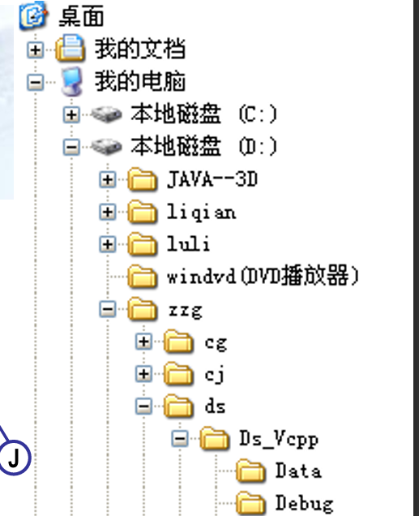
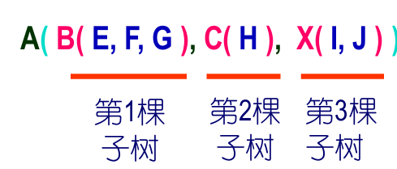
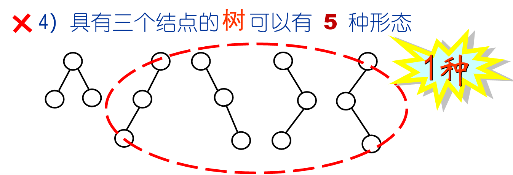

# Lecture 8 Tree
**数据结构 = 数据集合 + 关系集合**
---
## 树的概念
**1.结构**  n个节点。根节点，其余结点分割成m个**不相交**的子集 -- 递归定义
**2.逻辑** 
+ 只有一个节点没有前驱 -- **根节点**
+ 除根节点外，每个节点至多只有**一个前驱节点**

**3.表示方法**
+ 树形表示
+ 文氏图
+ 凹入表示 -- 电脑里的文件系统
   
+ 嵌套括号表示 
   

**4.基本属性**
+ 结点的度：该节点拥有的子树的数目。
+ 树的度：结点度最大值。
+ 叶子结点（度为零），分支结点。
+ 树的层次：以根节点为第一层，子节点加一
+ 树的有序性: 若树中结点的**子树的相对位置不能随意改变**, 则称该树为有序树，否则称该树为无序树。

---

## 二叉树
**1. 概念** 子树有严格的左、右之分且度≤2的树是二叉树。
+ 错误说法：度为2的有序树是二叉树（×）；度为2的是二叉树（×）。
  
**2. 易混淆** 二叉树形态有多种，但对应的树可能只有一种
+ 即使某节点只有一棵子树，也要区分左右子树

**3.特殊的二叉树**
+ **满二叉树** 所有节点的度要么为0，要么为2，且所有的叶子节点都在最后一层。（满了！）
+ **完全二叉树**  叶子节点只会出现在最后2层，且最后一层的叶子节点都靠左对齐（按照顺序排完了！）
  + 所有节点**从上往下，从左往右**依次排列。

### 二叉树的性质

****

